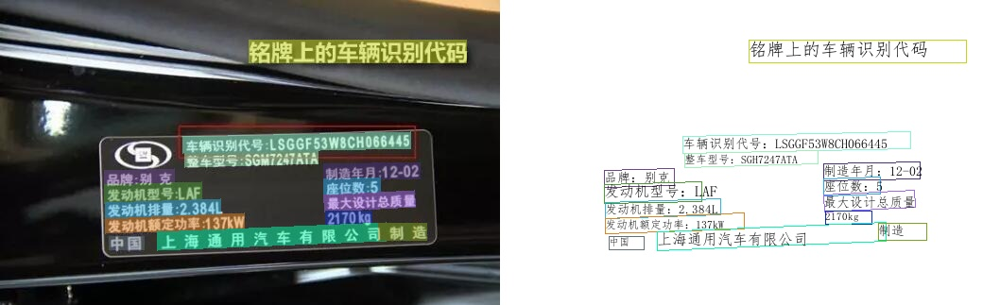

**Paddle_OCR_OPT**是基于PaddleOCR通用文字识别工具箱的二次封装，
旨在减少参数配置和提升代码完整性，快速实现生产模型的训练开发。

- [特性](#特性)
- [效果展示](#效果展示)
- [快速体验](#快速体验)
  - [试用通用模型](#试用通用模型)
  - [训练自用模型](#训练自用模型)
  - [模型评估](#模型评估)
  - [训练模型转为推理模型](#训练模型转为推理模型)
  - [Flask服务](#Flask服务)
  - [试用服务端通用模型](#试用服务端通用模型)
- [许可证书](#许可证书)


## 特性

- Paddle_OCR_OPT系列高质量预训练模型，准确的识别效果
    - 通用server系列：检测（47.2M）+方向分类器（0.9M）+ 识别（107M）= 155.1M
    - 超轻量压缩slim系列：检测（1.4M）+方向分类器（0.5M）+ 识别（1.6M）= 3.5M  
- 支持中英文数字组合识别、竖排文本识别、长文本识别
- 支持多语言识别：韩语、日语、德语、法语
- 支持用户自定义训练，提供丰富的预测推理部署方案
- 可运行于Linux、Windows、MacOS等多种系统

## 效果展示




## Pipeline

Paddle_OCR_OPT是一个实用的超轻量OCR系统。主要由DB文本检测、检测框矫正和CRNN文本识别三部分组成。
该系统从骨干网络选择和调整、预测头部的设计、数据增强、学习率变换策略、正则化参数选择、预训练模型使用
以及模型自动裁剪量化8个方面，采用19个有效策略，对各个模块的模型进行效果调优和瘦身，
最终得到整体大小为3.5M的超轻量中英文OCR和2.8M的英文数字OCR。

## 快速体验

- 安装依赖
```shell
pip install -r requirements.txt -i https://mirror.baidu.com/pypi/simple
```

- 代码结构


```
-- fastai_OCR
    |-- ppocr              # 算法核心
    |-- tools              # 工具文件
    |-- weights            # 预训练模型，存放在Google Drive：https://drive.google.com/file/d/1YQFCKdcGbQW0RUvULKqMcid8YNbr0HK5/view?usp=sharing
    |-- configs            # 配置文件
    |-- docs               # 展示文件
    |-- datasets           # 数据集文件   
    |   |-- images         # 图片文件
    |   |   |-- 00001.jpg
    |   |   |-- ...
    |   |-- anno_gt.txt    # 标注文本
    |-- __init__.py        # 库标识
    |-- LICENSE            # Apache 2.0 license
    |-- requirments.txt    # 依赖库
    |-- README.md          # 使用文档
    |-- app.Dockerfile     # Flask服务DockerFile
    |-- main_infer.py      # 模型推理范例
    |-- main_train.py      # 模型训练范例
    |-- main_eval.py       # 模型评估范例
    |-- main_convert.py    # 模型转换范例
    |-- main_app.py        # 模型服务范例
```

- 配置表

<details>
<summary>ocr_config.conf</summary>

```
[dl]
# 任务场景, 字符检测识别[ocr]，必填项（无需修改）
model_type = ocr

[train]
# model
# 训练时权重保存路径，可写相对或绝对路径，训练时必填项(无需修改)，字符串
weight_save_dir = ./output
# 文字检测，继续训练的权重文件夹路径，训练时可选项（无时空置，有时以best_accuracy结尾），字符串，默认为空
det_checkpoints_weight_dir =
# 文字识别，继续训练的权重文件夹路径，训练时可选项（无时空置，有时以best_accuracy结尾），字符串，默认为空
rec_checkpoints_weight_dir =

# dataset
# 数据集图片文件夹路径，必填项，字符串
dataset_dir = D:/Plate_OCR/13/CCPD2019.tar/CCPD2019/ccpd_base
# 数据集标注txt文本文件，包含检测和识别标注信息，必填项，字符串
label_file_path = D:/Plate_OCR/13/CCPD2019.tar/CCPD2019/det_gt_test.txt

# 文字识别 数据字典txt文本文件，即包含需检测识别文字集合，可选项（无时空置，用默认中文字典），字符串
rec_char_dict_path = D:\Plate_OCR\13\CCPD2019.tar\CCPD2019\splits\plate_dict.txt
# 文字识别 文字类别，中文ch，英文en，必填项，字符串，默认[ch]
rec_char_type = ch

# training
# text detect 文字检测参数
# 训练时迭代轮数，训练时必填项，整型数字，推荐[100][200][500]等，默认[100]，必填项
det_epochs = 100
# 训练数据的批大小，训练时必填项，整型数字，与图像大小及训练平台显存有关，图像较大或显存较小时，该值取较小值，推荐2的倍数，默认[2]，必填项
det_batch_size = 16
# 图像宽度，训练时必填项，整型数字，推荐32的倍数，[416][512][640]等，默认[640]，必填项
det_input_width= 640
# 图像高度，训练时必填项，整型数字，推荐32的倍数，[416][512][640]等，建议图像长宽一致，必填项
det_input_height = 640


# text recognize 文字识别参数
# 训练时迭代轮数，训练时必填项，整型数字，推荐[100][200][500]等，默认[100]，必填项
rec_epochs = 100
# 训练数据的批大小，训练时必填项，整型数字，与图像大小及训练平台显存有关，图像较大或显存较小时，该值取较小值，推荐2的倍数，默认[2]，必填项
rec_batch_size = 32
# 文字区域图像宽度，小长条图像，训练时必填项，整型数字，推荐2的倍数，默认[320]，必填项
rec_input_width= 320
# 文字区域图像高度，小长条图像，训练时必填项，整型数字，推荐2的倍数，默认[32]，必填项
rec_input_height = 32

[test]
# 测试图像文件夹路径，字符串，必填项
test_image_dir = ./test
# 测试结果图像文件夹路径，字符串，必填项
test_result_dir = ./inference_results
# 训练好的 文字检测 模型文件夹路径，字符串，可选项（无时空置，使用内置默认检测模型）
det_model_dir = ./output/det/inference
# 训练好的 文字识别 模型文件夹路径，字符串，可选项（无时空置，使用内置默认识别模型）
rec_model_dir = ./output/rec/inference
```

</details>

### 试用通用模型

  设置[ocr_config.conf](configs/ocr_config.conf)配置表中[test]节点的`test_image_dir`测试图像路径，将`det_model_dir`和`rec_model_dir`设置为空，使用默认模型进行预测。

```python main_infer.py
python main_infer.py
```

### 训练自用模型

1、准备标注数据文本文件，文件格式形如：

```
" 图像文件名        （中间用"\t"分隔）       json.dumps编码的图像标注信息"
img_1.jpg    [{"transcription": "MASA", "points": [[31, 10], [41, 14], [41, 21], [31, 17]]}, {...}]
```

json.dumps编码前的图像标注信息是包含多个字典的list，字典中的 `points` 表示文本框的四个点的坐标(x, y)，从左上角的点开始顺时针排列。 `transcription` 表示当前文本框的文字，**当其内容为“###”时，表示该文本框无效，在训练时会跳过。**

*※ 注意：此标注文本文件为包含两个训练阶段的数据集。有检测的文字区域位置数据，也包含了对应的字符标签。
在文字识别训练时，会自动将对应坐标包围区域内截取局部图像（细长条），携带对应标签文字进行识别训练。*

2、准备文字识别字典文本文件，并在[ocr_config.conf](configs/ocr_config.conf)配置表内设置rec_char_dict_path。

```
# plate_dict.txt
皖
沪
津
...
```

字典文件是一个包含训练集内需要识别的所有字符字典，一字一行，保存在txt文本中。

3、设置[ocr_config.conf](configs/ocr_config.conf)配置文件相关参数。

4、运行脚本，开始训练，模型保存在`outputs`路径下

```
python main_train.py
```

### 模型评估
OCR检测相关的指标：Precision、Recall、Hmean。

OCR识别相关的指标：acc、norm_edit_dis。

代码中指定训练时生成的配置文件`config.yml`，和设置`checkpoints`指向模型保存的路径。

```
python main_eval.py
```

### 训练模型转为推理模型

目前推理方式支持基于训练引擎推理和基于预测引擎推理。

（1）基于训练引擎推理不需要转换模型，但是需要先组网再load参数，语言只支持python，不适合系统集成。

（2）基于预测引擎的推理需要先转换模型为inference格式，然后可以进行不需要组网的推理，语言支持c++和python，适合系统集成。

因此，建议先将训练模型转换为推理模型，修改[main_convert.py](main_train.py)，指定训练模型保存位置（精确到模型文件）`save_model_path`，然后运行:
```
python main_convert.py
```

### Flask服务

提供了基于Flask的预测服务（CPU、GPU）。详见[main_app.py](main_app.py)

基于python运行：
```
python main_app.py
```
基于docker运行：
```shell
docker build -t algorithm/paddle_ocr_opt:v1.0 -f app.Dockerfile .
docker run --restart always --name paddle_ocr_opt -p 8000:8000 \
-v /etc/localtime:/etc/localtime:ro -v /mnt/Paddle_OCR_OPT/weights:/app/paddle_ocr_opt/weights -d algorithm/paddle_ocr_opt:v1.0
```

### 试用服务端通用模型
试用服务端通用模型，无需修改任务参数。指定`main_app_offline.py`中`image_dir`图片文件路径，基于python运行：
```
python main_app_offline.py
```

## 许可证书

本项目的发布受[Apache 2.0 license](LICENSE)许可认证。